The Learning & Reasoning group studies the ways machine learning, symbolic knowledge and formal reasoning can interact to enhance one another, based on the premise that inductive data-driven learning and deductive knowledge-based reasoning have complementary strengths and weaknesses.

A vast amount of the world's data and knowledge is relational in nature. By designing machine learning methods that consume such symbolic, relational knowledge or interact with formal reasoning methods, it becomes possible to discover new knowledge, to detect mistakes in existing knowledge, and to develop alternative forms of inference.

In the other direction, the use of prior knowledge can improve machine learning methods by reducing the need for huge amounts of data and computing resources, and by making machine learning models more generalisable and interpretable. We study how symbolic methods can be used to represent such prior knowledge, and how formal reasoning can be combined with learning to achieve the best of both worlds.

We apply our results in a variety of different domains, with a particular emphasis on medicine and scientific discovery.

## People

    <!-- <figure>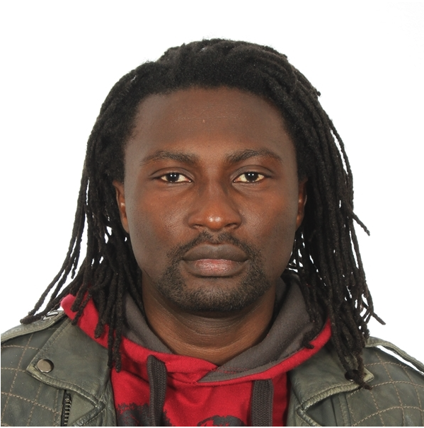
<figcaption>Al Idrissou</figcaption>
    </figure> -->
<figure>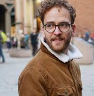
<figcaption>Andreas Sauter</figcaption>
    </figure><figure>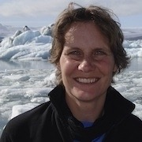
<figcaption><a href="https://www.cs.vu.nl/~annette/">Annette ten Teije</a></figcaption>
    </figure><figure>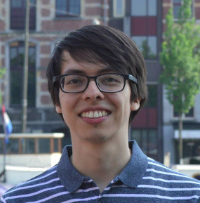
<figcaption><a href="https://dfdazac.github.io/">Daniel Daza</a></figcaption>
    </figure><figure>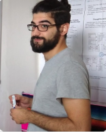
<figcaption><a href="https://dimitrisalivas.github.io/">Dimitrios Alivanistos</a></figcaption>
    </figure><figure>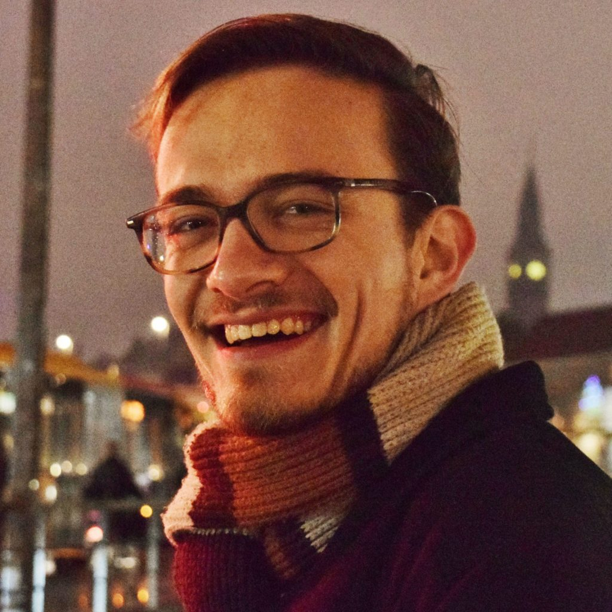
<figcaption><a href="https://emilevankrieken.com/">Emile van Krieken</a></figcaption>
    </figure><figure>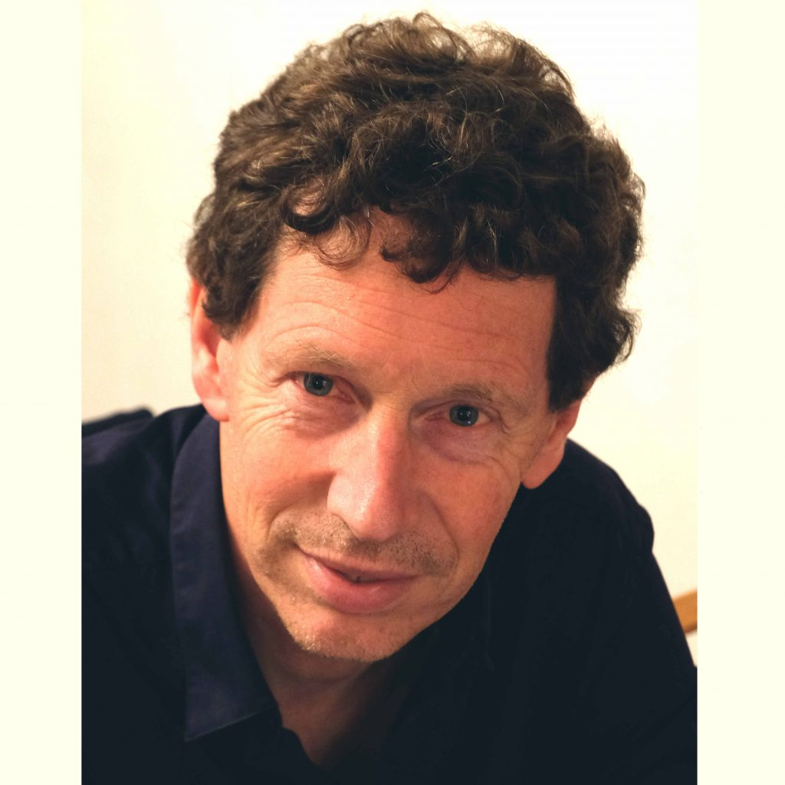
<figcaption><a href="https://www.cs.vu.nl/~frankh/">Frank van Harmelen</a></figcaption>
    </figure><figure>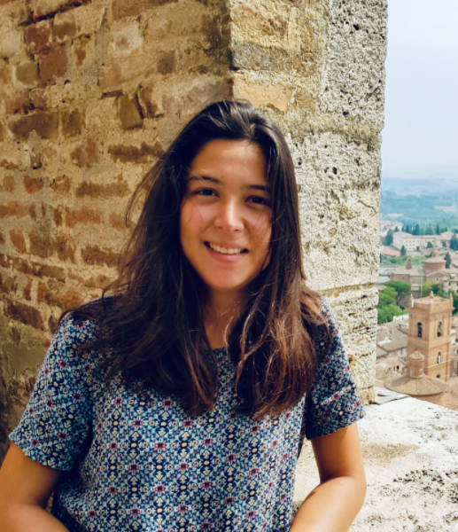
<figcaption>Inès Blin</figcaption>
    </figure><figure>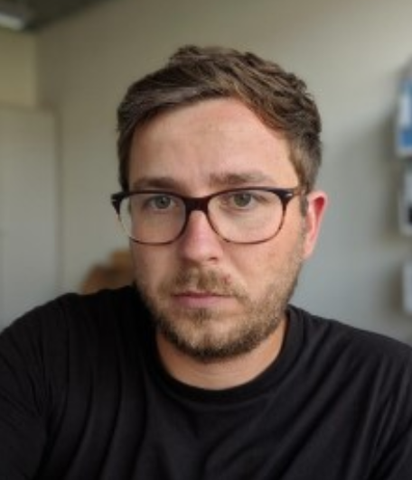
<figcaption>Jan-Christophe Kalo</figcaption>
    </figure><figure>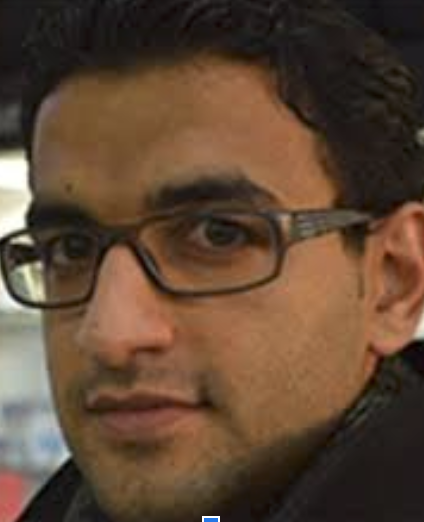
<figcaption>Majid Mohammedi</figcaption>
    </figure><figure>
<figcaption><a href="https://www.tudelft.nl/ewi/over-de-faculteit/afdelingen/intelligent-systems/interactive-intelligence/people/current-group-members/mani-tajaddini">Mani Tajaddini</a></figcaption>
    </figure><figure>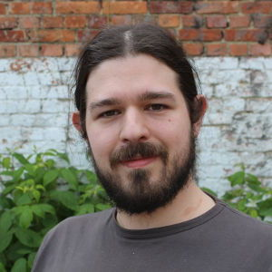
<figcaption><a href="https://www.cochez.nl/">Michael Cochez</a></figcaption>
    </figure><figure>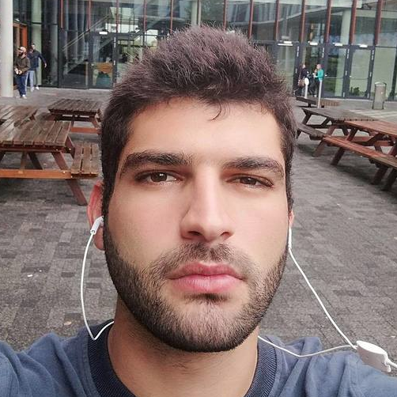
<figcaption>Nikos Kondylidis</figcaption>
    </figure><figure>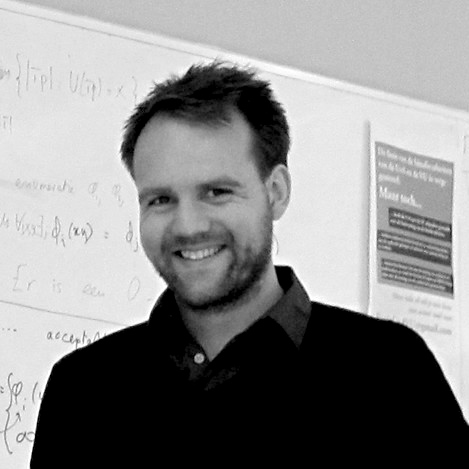
<figcaption><a href="http://peterbloem.nl/">Peter Bloem</a></figcaption>
    </figure><figure>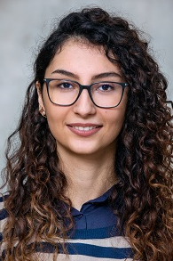
<figcaption>Taraneh Younesian</figcaption>
    </figure><figure>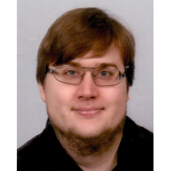
<figcaption>Xander Wilcke</figcaption>
    </figure>
<figure>
<figcaption>Taewoon Kim</figcaption>
    </figure>
<figure>
<figcaption>Ting Liu</figcaption>
    </figure>
<figure>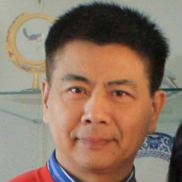
<figcaption>Zhisheng Huang</figcaption>
    </figure>

### Guests ###

    <figure>
<figcaption>Ali Khalili</figcaption>
    </figure>
    <figure>
<figcaption>Thiviyan Thanapalasingam</figcaption>
    </figure>

## Contact

## Projects

